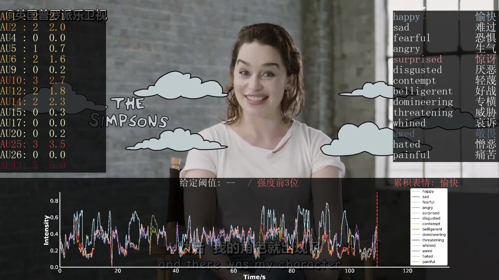

# Fine-grained Facial Expression Recognition System

<p align="center">

</p>

## Dependency

- python>=3.8
- pytorch==2.1.2
- torchvision==0.16.2

```bash
pip install -r requirements.txt
```

## Usage

### Dataset Preparation

#### Input
For `record` mode (`args.mode = 'record'`), the input video is recorded via a web camera.
For `load` mode (`args.mode = 'load'`), the input video is loaded from `args.videopath`.

#### Output
The outputs can be found in folder `args.savename`.

### Model Preparation
We provide pre-trained models for AU intensity estimation. You can download them and put them in `./detection/checkpoints`.
- Pre-trained models
    - Model pre-trained on [DISFA](http://mohammadmahoor.com/disfa/) (for AU1, 2, 4, 5, 6, 9, 12, 15, 17, 20, 25, 26): [disfa_model.pt](https://drive.google.com/file/d/1893uXuFdO8d7cuFAVx4sjDgg-RlDHlWC/view?usp=sharing).
    - Model pre-trained on [BP4D](http://www.cs.binghamton.edu/~lijun/Research/3DFE/3DFE_Analysis.html) (for AU6, 10, 12, 14, 17): [bp4d_model.pt](https://drive.google.com/file/d/1CdQoqahN1GwwnxzzJCqd8GbiRNEqKftR/view?usp=sharing).

### Run
After setting necessary arguments in run.py, to start analysis, simply run 

```bash
python run.py
```

The pipeline consists of two stages:
- Fine-grained facial expression recognition
    - Data preprocessing (filter out invalid frames)
        - Use `FaceDetection` for face detection and facial landmark detection (See `./detection/face_detection.py`).
    - AU detection (for each valid frame)
        - Use the model pre-trained on DISFA to estimate the intensity of 12 AUs (See `./detection/au_detection.py`).
        - Use the model pre-trained on BP4D to estimate the intensity of 5 AUs (See `./detection/au_detection.py`).
        - Use `EyeDetection` for closed eye detection (See `./detection/closed_eye_detection.py`).
        - Merge all the results and obtain AU intensity results for 15 AUs (AU1, 2, 4, 5, 6, 9, <u>10</u>, 12, <u>14</u>, 15, 17, 20, 25, 26, 43).
    - Fine-grained facial expression mapping
        - Use `ExpMapping` for global smoothing, automatic analysis, *etc.* (See `./detection/closed_eye_detection.py`).
- Visualization
    - Draw timing diagram figures for each frame (See `./utils/draw_fig.py`).
    - Merge timing diagram figures with the input video to generate the output video (See `./utils/draw_fig.py`).